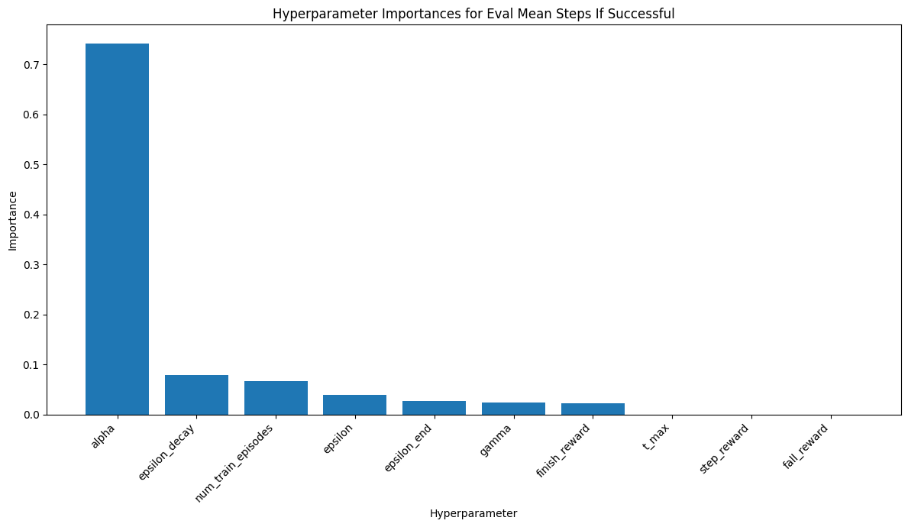

# Reinforcement Learning Hyperparameter Study on CliffWalking

An experimental comparison of four reinforcement learning algorithms (**Value Iteration**, **Model-Based RL**, **Q-Learning** and **REINFORCE**) on a *slippery* version of Gymnasium's [`CliffWalking-v0`](https://gymnasium.farama.org/environments/toy_text/cliff_walking/). For each algorithm we explore the hyperparameter space with random search, then measure the effect of each hyperparameter with Random Forest feature importances and plots.

> Course project for *Sistemes Intel·ligents Distribuïts* (SID) at the Facultat d'Informàtica de Barcelona (FIB, UPC).
> The full write-up (in Spanish, 48 pages) is in [`report/Practica2.pdf`](report/Practica2.pdf).

<p align="center">
  
  <br><em>Q-Learning: the learning rate α dominates the number of evaluation steps to reach the goal.</em>
</p>

## The environment

A 4×12 grid. The agent starts at state 36 (bottom left) and must reach state 47 (bottom right) without stepping into the cliff (states 37–46). With `is_slippery=True` each action moves in the intended direction only ⅓ of the time and slips sideways otherwise, so the environment is highly stochastic. By default each step costs −1 and falling off the cliff costs −100 and sends the agent back to the start. We also treat these **reward values as hyperparameters**.

## Method

- **Random search instead of grid search.** A full grid for Q-Learning alone would have taken about 14 days, so we sampled about 10% of each configuration space ([Bergstra & Bengio, 2012](https://www.jmlr.org/papers/v13/bergstra12a.html)). Value Iteration is deterministic and cheap, so it uses a full grid.
- **5 training runs per configuration** to estimate variance.
- **Analysis:** per-parameter box plots, reward-structure comparisons, top-10 rankings (combining steps-to-goal, success rate and training time), and Random Forest regressors whose feature importances rank the hyperparameters.

## Key findings

| Algorithm | Main takeaways | Best configuration found |
|---|---|---|
| **Value Iteration** | γ → 1 and a smaller convergence threshold ε both improve the policy. Beyond about 10 ms of training, the time spent barely matters. | ε = 0.01, γ = 0.99, rewards (finish 10, fall −1000, step −10) → **62.2 steps** on average |
| **Model-Based** | Value iteration on a model estimated from random trajectories. 5,000 trajectories gave clearly fewer steps than larger budgets. A small ε (0.005–0.01) gives good policies at a higher time cost. | See top-10 ranking in `model_based/Figures3/` |
| **Q-Learning** | A **low learning rate α** matters most, followed by a slow ε-decay and enough episodes (about 4,000–8,000). Long, careful exploration is key in a stochastic environment. | γ 0.95, α 0.05, ε 0.5, ε-decay 0.001, ε-end 0.01, 4,000 episodes, rewards (100, −100, −1) |
| **REINFORCE** | Performed poorly overall. A learning-rate decay of 1.0 (no decay) was better on every metric and much faster. Adding an entropy bonus to avoid local optima did **not** help. | See `reinforce/Figures/top_10_configurations.png` |

## Repository layout

```
├── report/Practica2.pdf          Full report (Spanish)
├── tools/genParams.py            Shared random-search trial generator (JSON)
├── value_iteration/              Grid search over γ, convergence threshold and rewards
├── model_based/
│   ├── ModelBased.py             Model-based RL experiment runner → fractional_results.csv
│   ├── genParamsM.py             Grouped trial generator
│   ├── ModelBasedParamAnalisis/  Random Forest + per-parameter plots
│   ├── Figures3/, DeepFigures/, figures/   Plotting scripts and generated figures
│   └── experiments/              Earlier prototypes (incl. Monte Carlo Tree Search tests)
├── q_learning/                   Numba-accelerated parallel study + analysis (see its README)
└── reinforce/
    ├── reinforce.py              REINFORCE agent (tabular softmax policy)
    ├── sweep/                    Parameter-sweep runners and raw results
    ├── analysisPipeline.py       Random Forest analysis → results_reinforce/
    ├── Figures/                  Plots for the main study
    ├── ReinforceIntentoMejora/   Improvement attempt with an entropy bonus
    └── experiments/              Earlier variants
```

## Running

```bash
pip install -r requirements.txt
```

Each script reads and writes files **relative to its own folder**, so run it from there:

```bash
cd q_learning
python genParamsQ.py          # generate hyperparameter trials
python qlearningstudy.py      # train + evaluate (parallel, Numba)
python analysisPipeline.py    # plots + Random Forest importances in results/
```

The same pattern applies to `value_iteration/`, `model_based/` (`ModelBased.py`, then the scripts in its analysis folders) and `reinforce/` (`sweep/reinforce_claude.py`, then `analysisPipeline.py`). Experiment settings are constants at the top of each script.

## Authors

Víctor Ramírez Arimaha, Marcel Alabart Benoit and Adrià Cebrián Ruiz.
